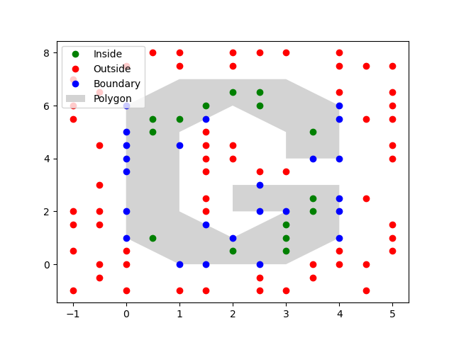

<!-- PROJECT LOGO -->
 

  

  <h3 align="center">CEGE0096 Point in Polygon</h3>

<!-- TABLE OF CONTENTS -->

  
Table of Contents

  <ol>
    <li><a href="#about-the-project">About The Project</a></li>
      <li><a href="#file-description">File Description</a></li>
	<li><a href="#acknowledgements-and-code-reference">Acknowledgements and Code Reference</a></li>
  </ol>

<!-- ABOUT THE PROJECT -->
## About The Project

The repository contains a program that tests whether a given point lies within a given polygon. It was completed as a portion of the CEGE0096 course for my MSc in Geospatial Science at UCL in the fall of 2020.
The program is designed to solve this problem through 2 methods, 1) the bounding box and 2) the ray casting algorithm.

1) The Bounding Box
* This method on its own is the simpliest and often ineffective if the polygon does not fall within the exact parameters of the bounding box itself. 
* Moving forward, it is used as a optimizing step to avoid running the ray casting algorithm through every testable point. 

2) The Ray Casting Algorithm
* This method is used to categorize points residing inside the minimum bounding box of the given polygon.
* Rays are constructed by generating a line from each test point to a point who's x-value outside the bounding box.
* Each line segment of the polygon is then tested against each ray to determine the intersection type. A counter is used to keep track of the intersection type. 
* Based on the counter result, a detemination is made whether the point is inside, outside, or and edge case.

<!-- FILE DESCRIPTION -->
## File Description: 
### main_from_file.py
* Contains a main function into which the user will supply three arguments: 
	1) the file path to the csv containing the polygonpoints in clockwise order 
	2) the csv containing the collection of input points for testing and 
	3) an output csv file path for the resulting point classifications.

### main_from_user.py
* Required the user to supply arguments to the main function, i) and iii) from above, but will prompt the user to input a point from the console in the format ‘x, y’. If the user fails to input the point in the correct format, an exception will be raised until the point is input correctly.
